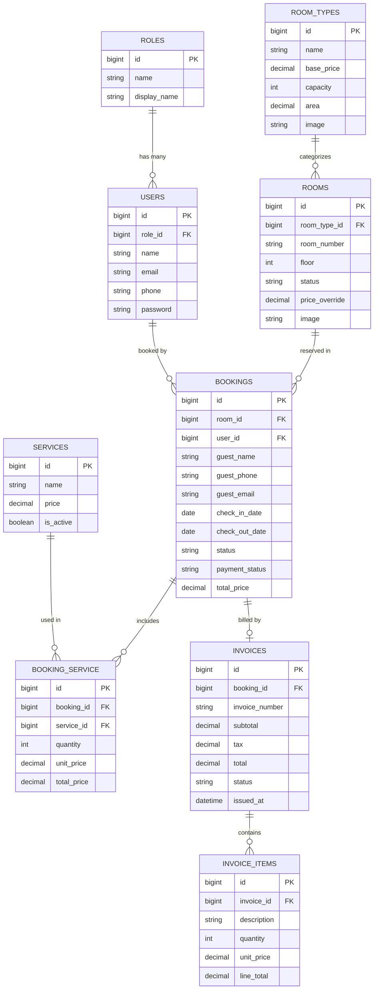

# 🏨 Radiant Hotel – Hệ thống Quản lý Khách sạn
> **Đồ án môn học:** Công nghệ Web (CNWEB)  
> **Sinh viên thực hiện:** Nguyễn Hữu Việt Thắng  
> **Repository:** [NguyenHuuVietThang-CNWEB](https://github.com/vietthangpq099-prog/NguyenHuuVietThang-CNWEB)

---

## 📌 1. Giới thiệu Dự án
Hệ thống Quản lý Khách sạn **Radiant Hotel** được xây dựng bằng framework **Laravel 12** kết hợp **MySQL (phpMyAdmin)**, cung cấp đầy đủ hai phân hệ:
1. **Phân hệ Khách hàng (Client):** Xem danh sách phòng, bộ lọc tìm kiếm theo ngày/giá/hạng phòng, trang xem chi tiết phòng (bộ sưu tập ảnh các góc phòng ngủ, đánh giá độ yên tĩnh & cách âm, tiện ích bên trong khách sạn), quy trình đặt phòng trực tuyến.
2. **Phân hệ Quản trị & Lễ tân (Admin/Receptionist):**
   - **Dashboard:** Biểu đồ doanh thu tương tác (Chart.js), biểu đồ trạng thái phòng, thống kê lấp đầy.
   - **Sơ đồ phòng (Room Matrix):** Lưới trạng thái phòng 5 màu trực quan, cập nhật nhanh qua AJAX.
   - **Quy trình Check-in / Check-out:** Quản lý đặt phòng, thêm/huỷ dịch vụ phụ (ăn uống, giặt ủi, spa...), tự động xuất hoá đơn tính thuế VAT 10% khi trả phòng.
   - **Quản lý danh mục (CRUD):** Quản lý danh sách phòng, hạng phòng, dịch vụ phụ, hoá đơn có hỗ trợ in (`@media print`).

---

## 🗄️ 2. Sơ đồ CSDL & Liên kết bảng (Database ERD Diagram)

Sơ đồ quan hệ thực thể (ERD) được thiết kế chuẩn hoá trên MySQL:



---

## ⚙️ 3. Cấu hình & Liên kết MySQL trên phpMyAdmin

### Bước 1: Khởi động XAMPP
- Mở **XAMPP Control Panel**, nhấn **Start** cho cả **Apache** và **MySQL**.

### Bước 2: Tạo cơ sở dữ liệu trên phpMyAdmin
- Truy cập trình duyệt: `http://localhost/phpmyadmin`
- Tạo mới database tên: `hotel_management` (Bảng mã: `utf8mb4_unicode_ci`).

### Bước 3: Cấu hình file `.env`
Dự án đã được liên kết với MySQL XAMPP qua cấu hình trong file `.env`:
```env
DB_CONNECTION=mysql
DB_HOST=127.0.0.1
DB_PORT=3306
DB_DATABASE=hotel_management
DB_USERNAME=root
DB_PASSWORD=
```

### Bước 4: Chạy Migration & Nạp dữ liệu mẫu
Mở Command Prompt (CMD) tại thư mục dự án và chạy:
```bash
php artisan migrate:fresh --seed
```
*(File sao lưu dữ liệu hoàn chỉnh `database/hotel_management.sql` cũng đã được đính kèm sẵn trong mã nguồn).*

---

## 🚀 4. Khởi chạy ứng dụng

```bash
php artisan serve
```
Mở trình duyệt truy cập: 👉 **http://127.0.0.1:8000**

---

## 🔑 5. Tài khoản dùng thử hệ thống

| Phân quyền | Email | Mật khẩu | Chức năng |
|---|---|---|---|
| **Quản trị viên (Admin)** | `admin@hotel.com` | `password` | Toàn quyền cấu hình phòng, loại phòng, dịch vụ, tài chính |
| **Lễ tân (Receptionist)** | `staff@hotel.com` | `password` | Quản lý sơ đồ phòng, đặt phòng, check-in, check-out, hoá đơn |
